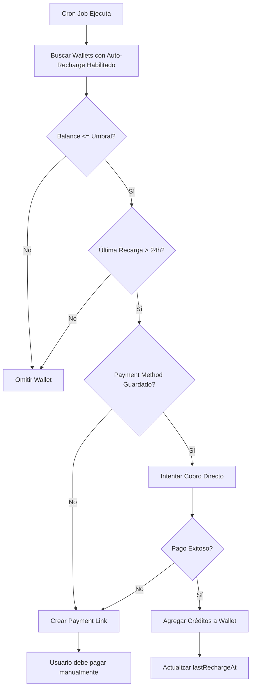

# 💳 Flujo de Recarga Automática con Stripe

Este documento explica cómo funciona el sistema de recarga automática de wallets usando Stripe, incluyendo el consentimiento del usuario y el proceso de cobro automático.

## 📋 Resumen del Flujo

El sistema de recarga automática funciona de la siguiente manera:

1. **Usuario guarda su método de pago** (tarjeta) de forma segura usando Stripe Setup Intent
2. **Usuario configura los límites** de recarga automática (umbral y monto)
3. **Usuario habilita la recarga automática** (consentimiento explícito)
4. **Sistema monitorea el balance** periódicamente (cron job)
5. **Cuando el balance baja del umbral**, el sistema cobra automáticamente usando el método de pago guardado

## 🔐 Consentimiento y Autorización del Usuario

### Paso 1: Guardar Método de Pago

El usuario **debe explícitamente** guardar su método de pago:

1. **Frontend**: El usuario hace clic en "Guardar método de pago" o similar
2. **Backend**: Se crea un Setup Intent de Stripe
   ```
   POST /api/wallet/payment-methods/setup
   ```
3. **Frontend**: Se muestra un formulario seguro de Stripe Elements para ingresar los datos de la tarjeta
4. **Usuario**: Ingresa los datos de su tarjeta en el formulario seguro
5. **Frontend**: Confirma el Setup Intent con Stripe.js
6. **Backend**: Se guarda el Payment Method ID
   ```
   POST /api/wallet/payment-methods/save
   Body: { setupIntentId: "seti_xxx" }
   ```

**⚠️ IMPORTANTE**: En este punto, el usuario solo está guardando su tarjeta. **NO se está cobrando nada todavía**.

### Paso 2: Configurar Recarga Automática

El usuario configura los parámetros de recarga automática:

1. **Umbral**: Balance mínimo que activa la recarga (ej: $10)
2. **Monto de recarga**: Cuánto se recargará automáticamente (ej: $50)
3. **Habilitar recarga automática**: Toggle ON/OFF

```
PATCH /api/wallet/auto-recharge
Body: {
  enabled: true,
  threshold: 10,
  rechargeAmount: 50,
  paymentMethodId: "pm_xxx" // Ya guardado en el paso anterior
}
```

**⚠️ CONSENTIMIENTO**: Al habilitar la recarga automática (`enabled: true`), el usuario está dando su **consentimiento explícito** para que el sistema:
- Monitoree su balance de wallet
- Cobre automáticamente cuando el balance esté por debajo del umbral
- Use el método de pago guardado para realizar el cobro

### Paso 3: Proceso Automático de Recarga

Una vez configurado, el sistema funciona automáticamente:

1. **Cron Job** ejecuta cada X horas (configurable):
   ```
   POST /api/cron/auto-recharge
   ```

2. **Sistema verifica** todas las wallets con:
   - `autoRecharge.enabled = true`
   - `balance <= threshold`
   - No se haya procesado una recarga en las últimas 24 horas

3. **Si se cumplen las condiciones**, el sistema:
   - Intenta cobrar usando `chargePaymentMethod()`
   - Crea un Payment Intent de Stripe con `confirm: true`
   - Stripe procesa el pago automáticamente
   - Si es exitoso, se agregan créditos a la wallet
   - Si falla, se crea un payment link como fallback

## 🔄 Flujo Detallado de Cobro Automático



## 📝 Código de Implementación

### 1. Guardar Método de Pago

```typescript
// Frontend: Crear Setup Intent
const response = await fetch('/api/wallet/payment-methods/setup', {
  method: 'POST'
});
const { clientSecret } = await response.json();

// Frontend: Confirmar Setup Intent con Stripe.js
const { setupIntent, error } = await stripe.confirmCardSetup(clientSecret, {
  payment_method: {
    card: cardElement,
  }
});

// Frontend: Guardar Payment Method
await fetch('/api/wallet/payment-methods/save', {
  method: 'POST',
  body: JSON.stringify({ setupIntentId: setupIntent.id })
});
```

### 2. Configurar Recarga Automática

```typescript
// Frontend: Usuario configura y habilita
await fetch('/api/wallet/auto-recharge', {
  method: 'PATCH',
  body: JSON.stringify({
    enabled: true,  // ← CONSENTIMIENTO EXPLÍCITO
    threshold: 10,
    rechargeAmount: 50,
    paymentMethodId: "pm_xxx"
  })
});
```

### 3. Cobro Automático (Backend)

```typescript
// src/lib/stripe.ts - chargePaymentMethod()
const paymentIntent = await stripe.paymentIntents.create({
  amount: Math.round(amount * 100),
  currency: 'USD',
  customer: customerId,
  payment_method: paymentMethodId,
  confirm: true,  // ← Cobro automático inmediato
  metadata: {
    userId: userId,
    walletId: wallet.id,
    type: 'auto_recharge',
  },
});

// Si es exitoso, agregar créditos
if (paymentIntent.status === 'succeeded') {
  await addCredits(wallet.id, amount, paymentIntent.id);
}
```

## ⚖️ Consideraciones Legales y de UX

### Consentimiento del Usuario

1. **Explícito**: El usuario debe activar manualmente el toggle de "Recarga Automática"
2. **Informado**: Debe ver claramente:
   - El umbral que activará la recarga
   - El monto que se cobrará
   - El método de pago que se usará
3. **Reversible**: El usuario puede deshabilitar en cualquier momento

### Mejores Prácticas

1. **Mostrar términos claros** antes de habilitar:
   ```
   "Al habilitar la recarga automática, autorizas a [Tu Empresa] 
   a cobrar automáticamente $[monto] a tu tarjeta [últimos 4 dígitos] 
   cuando tu balance baje de $[umbral]."
   ```

2. **Notificaciones**:
   - Enviar email cuando se procese una recarga automática
   - Notificar si un cobro falla
   - Recordar al usuario que puede deshabilitar en cualquier momento

3. **Límites de seguridad**:
   - No procesar más de una recarga cada 24 horas
   - Verificar que el balance realmente esté bajo el umbral
   - Manejar errores de tarjeta rechazada apropiadamente

## 🛡️ Seguridad

### Protección de Datos

- Los datos de tarjeta **nunca** tocan tu servidor
- Stripe maneja todo el procesamiento de pagos (PCI compliant)
- Solo guardamos el Payment Method ID (referencia segura)

### Manejo de Errores

- **Tarjeta rechazada**: Se crea un payment link como fallback
- **Tarjeta expirada**: El usuario debe actualizar su método de pago
- **Fondos insuficientes**: Se notifica al usuario

## 📊 Monitoreo y Logs

El sistema registra:
- Cuándo se guarda un método de pago
- Cuándo se habilita/deshabilita la recarga automática
- Cada intento de cobro automático
- Resultados de cada cobro (éxito/fallo)
- Errores y razones de fallo

## 🔍 Verificación del Estado

Para verificar si la recarga automática está funcionando:

1. **Ver configuración**:
   ```
   GET /api/wallet/auto-recharge
   ```

2. **Ver métodos de pago guardados**:
   ```
   GET /api/wallet/payment-methods
   ```

3. **Revisar logs del cron job**:
   - Buscar `[Cron] Iniciando verificación de recargas automáticas...`
   - Buscar `[Stripe] ✅ Recarga automática completada`
   - Buscar `[Stripe] ⚠️ Cobro directo falló`

## ❓ Preguntas Frecuentes

### ¿El usuario se "suscribe" a algo?

**No**, no es una suscripción tradicional. Es un **acuerdo de recarga automática**:
- No hay pagos recurrentes fijos
- Solo se cobra cuando el balance baja del umbral
- El usuario puede deshabilitar en cualquier momento
- No hay contratos ni períodos mínimos

### ¿Se cobra automáticamente sin consentimiento?

**No**. El usuario debe:
1. Guardar explícitamente su método de pago
2. Configurar los límites
3. **Habilitar manualmente** el toggle de recarga automática

### ¿Qué pasa si el usuario no quiere más recargas automáticas?

Simplemente deshabilita el toggle:
```
PATCH /api/wallet/auto-recharge
Body: { enabled: false }
```

O elimina su método de pago:
```
DELETE /api/wallet/payment-methods?paymentMethodId=pm_xxx
```

### ¿Se puede cambiar el método de pago?

Sí, el usuario puede:
1. Guardar un nuevo método de pago (reemplaza el anterior)
2. Eliminar el método de pago actual
3. Actualizar la configuración de recarga automática

